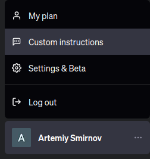
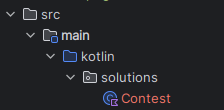
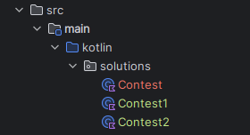
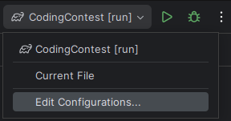
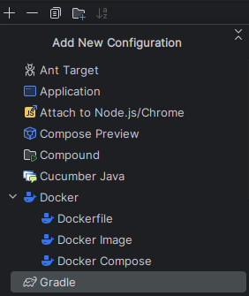
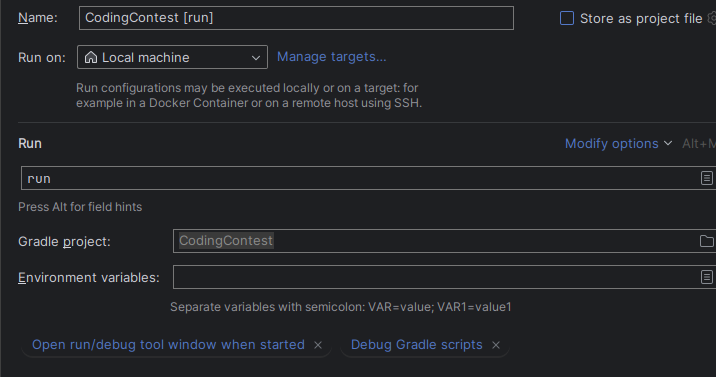
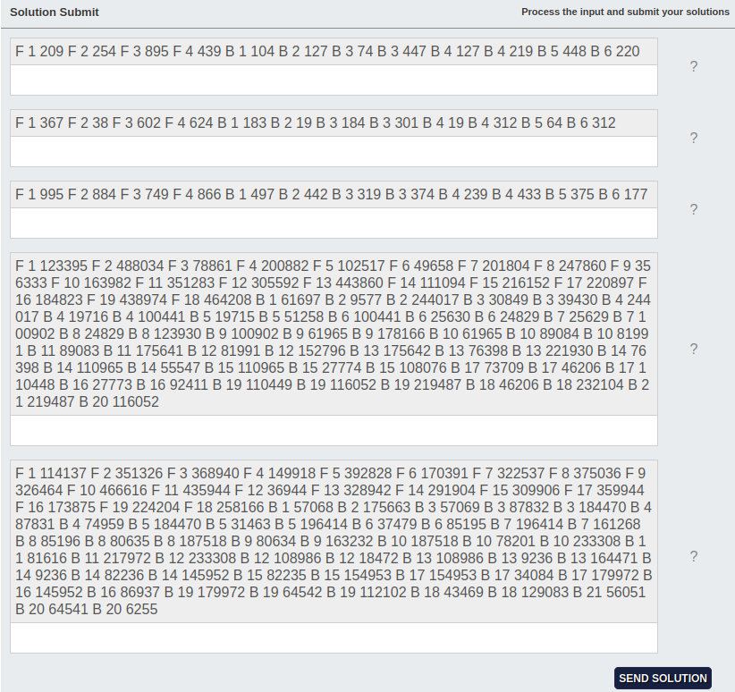
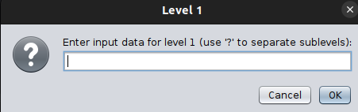
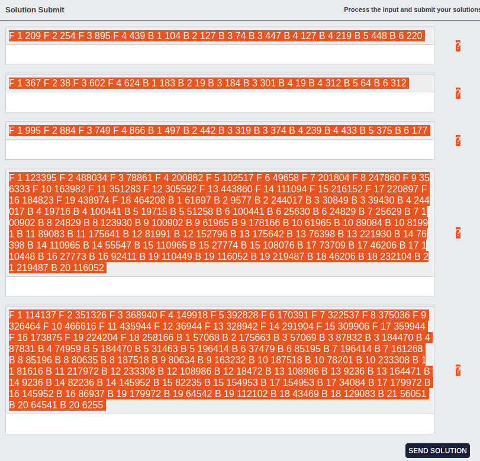
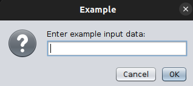

# Tutorial

## Pre-Requisites

### Software Requirements
- **IntelliJ IDEA Ultimate**
- **Java 17** (Note: Not Java 21)
- **Kotlin 1.9.0+**

### Configuration
- Navigate to `Settings -> Build, Execution, Deployment -> Build Tools -> Gradle -> Gradle JVM` and select Java 17.
- Set your browser's downloads directory to `/CodingContest/src/main/resources`. This way, all input zip files are automatically saved in the correct directory.

## AI GUIDE

### Text Recognition
- Use "ADVANCED DATA ANALYSIS" if the neccessary text in the Task PDF (Task description and IO description) can be copied with CTRL + A.
- In "ADVANCED DATA ANALYSIS" mode, request a download link for the code file, correctly named (e.g., `Contest1.kt`, `Contest2.kt`). This speeds up the process because the code is not typed out, but rather downloaded instantly.

### IF chat.openai.com AND PREMIUM:

#### What would you like ChatGPT to know about you to provide better responses?:

I'm in a Kotlin coding contest. I use files structured as:

```
package solutions

import Solution
import java.io.File

class Contest : Solution() {
    override fun solve(input: File): String {
        return ""
    }
}
```

The method `solve` takes a `File` as its input argument.


#### How would you like ChatGPT to respond?

Important: If context is missing and you are likely unable to generate perfect working code, then ask for that context, instead of outputting wrong code.
ALWAYS include package solutions and imports
import Solution
import java.io.File
Use Kotlin exclusively. Replace "until" with "..<". Ensure that the returned String is formatted correctly, with correct line breaks and correct variables, according to the task. All code should reside under the `package solutions`. Solutions should be exact, not approximations, prioritizing accuracy over computation speed. Avoid setting up external classes or environments outside of the provided template, and only forward the solution class. Minimize comment usage, only including them if critically necessary. Ensure that the provided code is fully functional without incomplete functions or placeholders. First write the code and then explain the approach so that it can be run while you are explaining. Call the class $Taskname$level, with $level starting with 1, and upgrading every time either I or the provided pdf (I copy paste pdfs) says so. If no Taskname is provided, call it Contest. ENSURE YOU DO NOT "FORGET" ANY OF THIS DURING THE CONVERSATION.

### If bing chat just paste this as the first message, it fits. Make sure you have backup accounts for bing chat.


## How to Create a New Level


1. Duplicate `Contest.kt` and rename it to match the new level, such as `Contest1.kt` for Level 1 or `Contest2.kt` for Level 2.
2. Write your code in the `solve(input: File): String` method.
3. Utilize `input.readLines()` to get a list of strings or `input.readText()` to get the entire input as a single string, depending on the task requirements.

## How to Run the Code



1. Edit configurations.
2. Create a new Gradle configuration.
3. Add `run` to the arguments.
4. Run the program using `Shift + F10` or `Shift + FN + F10`, depending on your keyboard settings.

## Special Cases
### If the input is not in zip files, but rather in plain text, then see below:

  
- If the input appears as shown in the example, remove any folders or zip files named `level1`, `level2`, etc.
- Run the program, and a window will appear where you can paste your input.  
  
    
    
    
- You can add example input from the pdf here, or skip it by pressing Cancel.
- Pressing OK with nothing in the input field = Pressing Cancel.
