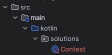
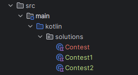
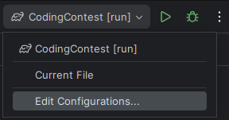
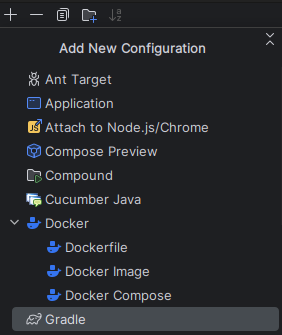
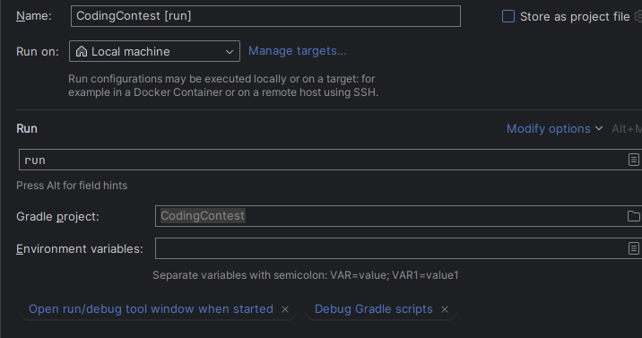
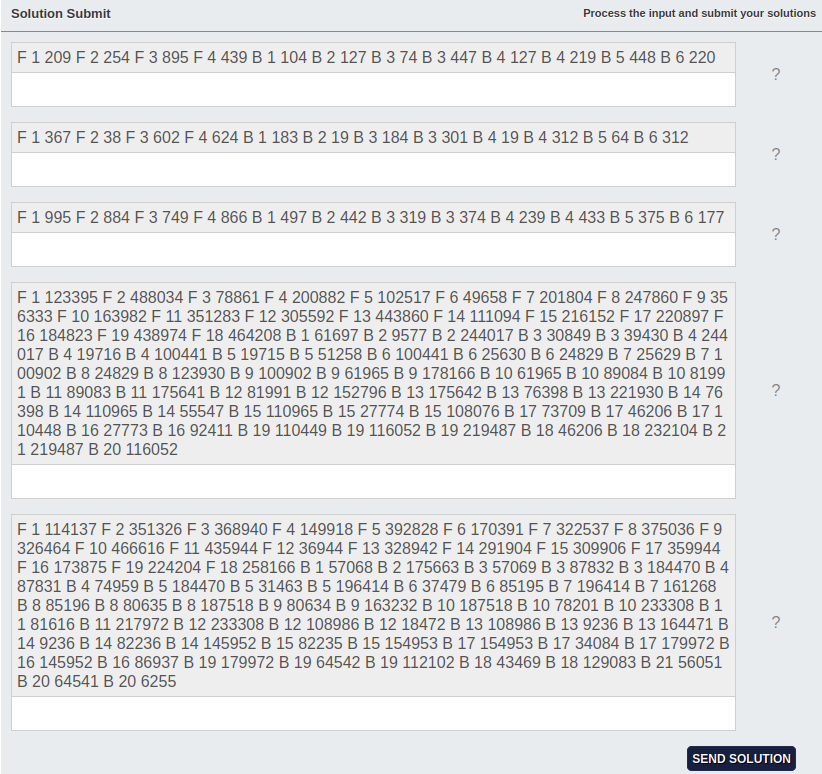
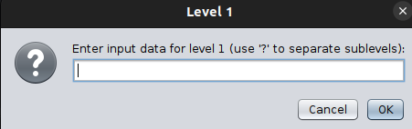
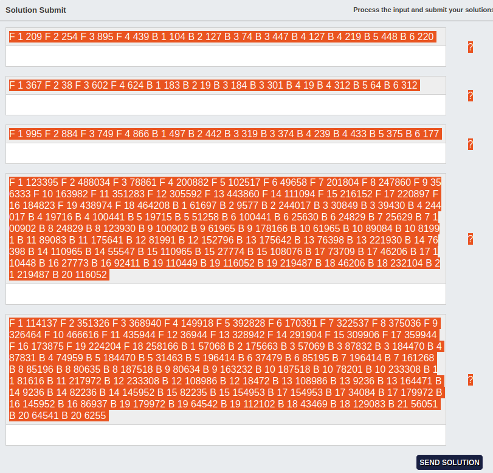
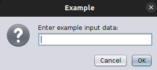

# Tutorial

## Pre-Requisites

### Software Requirements
- **IntelliJ IDEA Ultimate**
- **Java 17** (Note: Not Java 21)
- **Kotlin 1.9.0+**

### Configuration
- Navigate to `Settings -> Build, Execution, Deployment -> Build Tools -> Gradle -> Gradle JVM` and select Java 17.
- Set your browser's downloads directory to `/CodingContest/src/main/resources`. This way, all input zip files are automatically saved in the correct directory.

## How to Create a New Level

1. Duplicate `Contest.kt` and rename it to match the new level, such as `Contest1.kt` for Level 1 or `Contest2.kt` for Level 2.
2. Write your code in the `solve(input: File): String` method.
3. Check out the [utils](src/main/kotlin/utils) package for useful data structures and helper functions.
4. Utilize `input.rl()` to get a list of strings (trimmed end) or `input.rt()` to get the entire input as a single string (trimmed), depending on the task requirements.

## How to Run the Code

1. Edit configurations.
2. Create a new Gradle configuration.
3. Add `run` to the arguments.
4. Run the program using `Shift + F10` or `Shift + FN + F10`, depending on your keyboard settings.

## Special Cases
### If the input is not in zip files, but rather in plain text, then see below:

  
- If the input appears as shown in the example, remove any folders or zip files named `level1`, `level2`, etc.
- Run the program, and a window will appear where you can paste your input.  
  
    
    
    
- You can add example input from the pdf here, or skip it by pressing Cancel.
- Pressing OK with nothing in the input field = Pressing Cancel.
